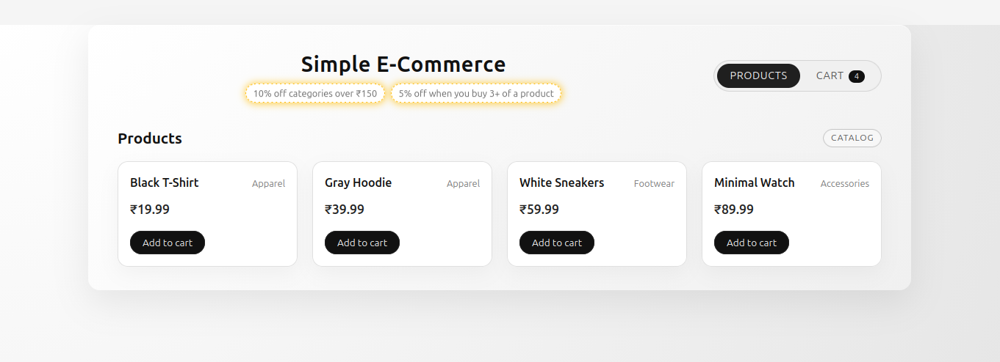
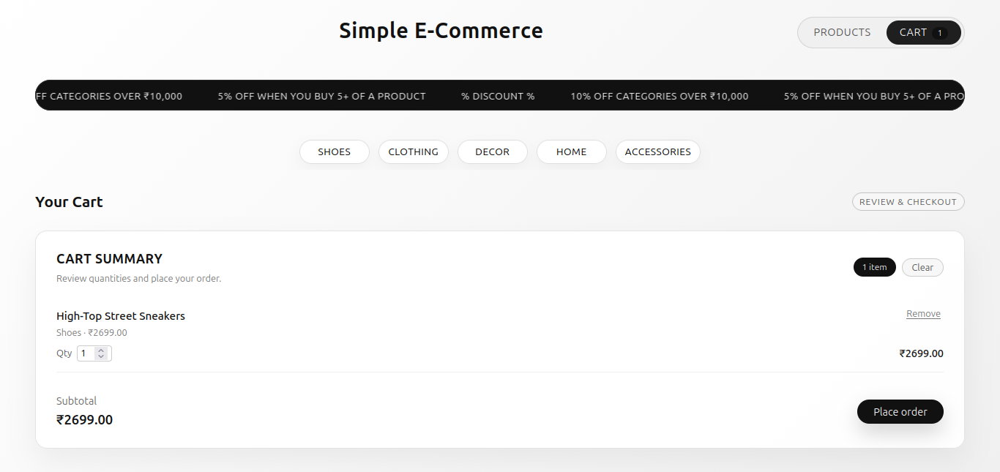
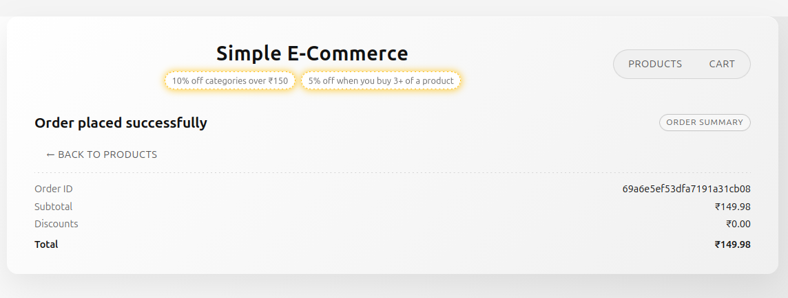

## Simple E‑Commerce App (MERN)

This project is a small end‑to‑end e‑commerce demo with discounts, a product catalog, a cart, and order storage.

- **Frontend**: React (Vite) in `frontend` (with React Router)
- **Backend**: Node.js + Express in `backend`
- **Database**: MongoDB via Mongoose (configured in `backend/src/config/db.js`)

---

### Setup instructions

- **Folder structure**

  - `frontend/`
    - `src/main.jsx`: React entry point, sets up `BrowserRouter`, routes, and `CartProvider`
    - `src/App.jsx`: Layout shell (header with discounts, product/cart toggle, footer)
    - `src/pages/ProductsPage.jsx`: Product catalog page
    - `src/pages/CartPage.jsx`: Cart page + checkout button
    - `src/pages/OrderConfirmationPage.jsx`: Order bill page after placing an order
    - `src/context/CartContext.jsx`: Cart state (add/remove/update/clear)
    - `src/components/ProductGrid.jsx` / `ProductCard.jsx`: Product listing UI
    - `src/components/CartPanel.jsx`: Cart line items and checkout action

    
  - `backend/`
    - `.env.example`: Example `PORT` and `MONGODB_URI`
    - `src/server.js`: Server entry (connects to MongoDB and starts HTTP server)
    - `src/app.js`: Express app + routes wiring
    - `src/config/db.js`: MongoDB connection helper
    - `src/models/product.model.js`: Product schema
    - `src/models/order.model.js`: Order schema
    - `src/controllers/product.controller.js`: Product listing / seeding
    - `src/controllers/checkout.controller.js`: Checkout calculation + order creation
    - `src/controllers/order.controller.js`: View and delete orders
    - `src/routes/product.routes.js`: `/api/products`
    - `src/routes/checkout.routes.js`: `/api/checkout`
    - `src/routes/order.routes.js`: `/api/orders`

- **1. Start MongoDB**

  Make sure a MongoDB instance is running and that you have a connection string (URI), for example:

  - Local default: `mongodb://127.0.0.1:27017/simple-ecommerce`

### 2. Backend (API)

```bash
cd backend
cp .env.example .env
# edit .env and set MONGODB_URI to your Mongo instance, for example:
# MONGODB_URI=mongodb://127.0.0.1:27017/simple-ecommerce

npm install
npm run dev      # runs on http://localhost:5000
```

Useful backend URLs:

- `GET http://localhost:5000/api/health` – health check
- `GET http://localhost:5000/api/products` – list products (auto‑seeds a few sample products on first call)
- `POST http://localhost:5000/api/checkout` – create an order from cart items
- `GET http://localhost:5000/api/orders` – list all orders in the DB
- `GET http://localhost:5000/api/orders/:id` – fetch one order by ID (used by the order bill page)
- `DELETE http://localhost:5000/api/orders` – delete **all** orders

### 3. Frontend (React)

```bash
cd frontend
npm install
npm run dev      # usually http://localhost:5173
```

Then open the Vite dev server URL in your browser.

---

### Assumptions made

- **Single‑user demo**: No authentication or multi‑user handling; cart is per browser session only.
- **Local development environment**:
  - Backend runs on `http://localhost:5000`.
  - Frontend runs on `http://localhost:5173`.
  - MongoDB is reachable at `mongodb://127.0.0.1:27017/simple-ecommerce` (or whatever you configure as `MONGODB_URI`).
- **Discount rules are fixed** and hard‑coded:
  - 10% off any category where your spend is over ₹10,000.
  - 5% off any product line where you buy 5 or more units.
- **Currency**: All prices and totals are in INR (₹).
- **Data model is minimal**:
  - Products only have `name`, `price`, and `category`.
  - Orders only store line items, discounts, and summary totals.

---

### Trade‑offs and design decisions

- **Simple routing**:
  - Uses React Router with three main routes: `/products`, `/cart`, `/order/:orderId`.
  - `App.jsx` acts as the shared layout (header/footer and discount display) so the discount message is visible on all pages.
- **State management**:
  - Cart is implemented with a lightweight React Context (`CartContext.jsx`) instead of a heavier state library.
  - Cart is **not** persisted to local storage; reloading the page clears it.
- **Product seeding**:
  - If the `products` collection is empty, `GET /api/products` seeds a few sample products on the first call.
  - This keeps setup simple: you do not need to manually insert products for the demo.
- **Order storage & retrieval**:
  - `POST /api/checkout` performs pricing and discount calculation on the server and writes an `Order` document to MongoDB.
  - The order confirmation page takes the `orderId` from the response and:
    - Shows the breakdown passed from the checkout response.
    - Can fall back to `GET /api/orders/:id` if needed.
- **UI & styling**:
  - UI is intentionally minimal but modern:
    - Centered title “Simple E‑Commerce” with two discount badges.
    - Badges use a subtle pulse animation to keep discounts highlighted on all pages.
    - Top‑right “Products” / “Cart” toggle with a badge for cart item count.
  - The cart page shows all cart items directly (no inner scroll) and uses a single page scroll instead.

---

### UI screenshots
- **Products page**

  
  

- **Cart page**

  
  


- **Order confirmation (bill) page**

  
  


## Frontend behaviour and pages

- **Header (top center)**:
  - Shows the title `Simple E‑Commerce`
  - Under the title, two visible discount badges:
    - `10% off categories over ₹150`
    - `5% off when you buy 3+ of a product`
- **Top‑right toggle**:
  - `Products` and `Cart` are shown as navigation buttons (React Router `NavLink`s)
  - The active page is highlighted.
- **Pages**:
  - `/products` – product catalog page with an “Add to cart” button on each item.
  - `/cart` – cart page, where you can:
    - See items, quantities, category and price
    - Change quantity or remove items
    - Clear the cart
    - Click **Place order** to checkout
  - `/order/:orderId` – order confirmation/bill page:
    - Shows the **Order ID**, **Subtotal**, all **Discounts**, and the final **Total**.
    - This page is opened automatically after you click **Place order** and the backend returns an `orderId`.

## How checkout and the bill page work

1. On `/cart`, clicking **Place order** calls `POST /api/checkout` with the cart items.
2. The backend:
   - Applies the discount rules (10% per category over ₹10,000, 5% when you buy 5+ of the same product).
   - Stores an `Order` document in MongoDB.
   - Returns `{ orderId, subtotal, discounts, total }`.
3. The frontend:
   - Clears the cart.
   - Navigates to `/order/<orderId>` and shows the order bill.
4. The order bill page:
   - Reads the breakdown from navigation state if available.
   - If needed, fetches from `GET /api/orders/:id` to show the same data from the DB.

## How to see data currently in the database

You have two options:

- **Option A – Use the API endpoints**
  - Orders: `GET http://localhost:5000/api/orders`
  - Products: `GET http://localhost:5000/api/products`
  - You can call these using a browser, `curl`, Postman, or Insomnia.

- **Option B – Use MongoDB tools directly**
  - Using `mongosh` (Mongo shell), for example:

    ```bash
    mongosh "mongodb://127.0.0.1:27017/simple-ecommerce"
    ```

    Then inside the shell:

    ```js
    use('simple-ecommerce');
    db.products.find();
    db.orders.find();
    ```

  - Or use MongoDB Compass or any GUI to connect with the same URI.

## How to delete all records in the DB

Be careful: these operations are destructive.

- **Delete all orders via API**:

  ```bash
  curl -X DELETE http://localhost:5000/api/orders
  ```

- **Delete records directly in MongoDB (using mongosh)**:

  ```bash
  mongosh "mongodb://127.0.0.1:27017/simple-ecommerce"
  ```

  Then run:

  ```js
  use('simple-ecommerce');
  db.orders.deleteMany({});    // delete all orders
  db.products.deleteMany({});  // delete all products (if you really want a clean DB)
  ```


